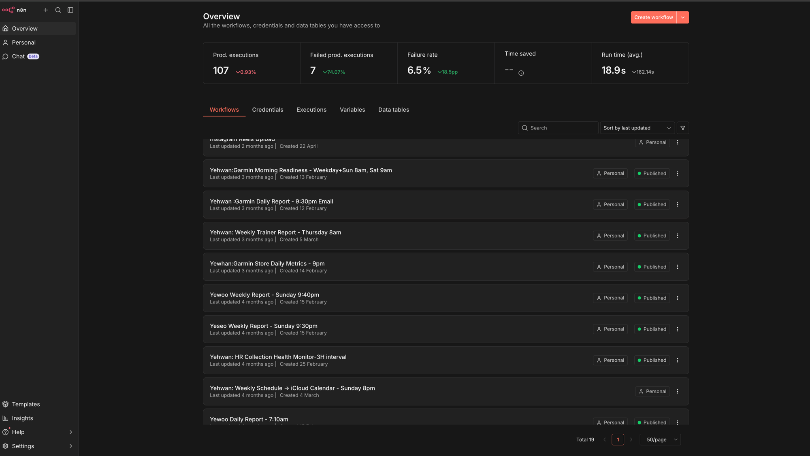

# GarminConnector

## Behind the Story

A Garmin watch collects an enormous amount of physiological data — HRV, sleep, training load, body battery, stress — but turns almost none of it into real insight. Garmin's own AI coaching add-on, Connect+, costs $6.99/month and was widely panned at launch: users complained it just restated numbers they could already see for free (like step counts) while paywalling features on watches that already cost hundreds of dollars.

This project set out to close that gap for one athlete first: my son, a competitive tennis player. We already knew what real coaching looked like: my son's personal trainer, at about $120 an hour a session, would review the week's data and set real goals for the week ahead. This project aims for that same standard of coaching, but daily instead of weekly, focused on two things:

1. **Avoiding injury** — the main reason to hire a trainer in the first place is to avoid overexercising into injury. Injury is one of the scariest, most disruptive things an athlete can face, and one of the biggest threats to actually improving. Catching fatigue or poor recovery the morning after, instead of finding out five days later, is what makes that possible.
2. **Planning** — knowing exactly where my son's current condition and progress sit against the goal, at any given moment. That's what makes it possible to adjust the plan when needed, and just as importantly, to recognize and reinforce what's already working.

Long-term, the aim is to turn this into a commercial service that extracts the value wearables collect but never deliver.

## Overview

It starts with my son and the watch. Two things have to happen on his end: he wears it all the time, and when he goes to play tennis, he starts the Tennis activity on the watch and stops it when he's done — that's what gives every session a precise start and end time. With the watch on, Garmin's API is pulling his heart rate roughly every 2 minutes, 24 hours a day. If it goes more than 3 hours without a reading, he gets an SMS telling him to put the watch back on.

Everything downstream is built on that raw stream. This project turns it — sleep, HRV, resting heart rate, training load, workouts — into something a coach would actually say to him: how recovered he is this morning, whether today should be a hard session or a rest day, and how the week is trending.

The day runs on a fixed rhythm. At 9pm, the day's metrics land in the database and my son's profile and training intensity baselines get updated. A half hour later, he gets a report on how today went, compared against the last 7 days — a visual read on where he's at. The most important report comes in the morning: it pulls yesterday's training (hours, pattern, intensity) together with overnight recovery data, and it's the combination of the two that lets the AI actually recommend today's training — how much, what pattern, what intensity — and flag if he's at risk of overexercising into injury. Thursday at 8am, right before he sees his human trainer, he gets a weekly report to check how the week went and what's next — something to compare against the trainer's own read on his progress.

## How It Works

```
n8n (scheduler) → SSH → Docker runs Python script → stdout (raw Garmin data)
                → SSH → Claude CLI + /command < raw data → stdout (AI coaching)
                → Combines both → Email (data + AI) + Telegram (AI only)
```

Nothing here is manual. Five n8n workflows run on a schedule, each one SSHing into a Raspberry Pi to run a Python script against the Garmin Connect API, storing the results in PostgreSQL and handing the numbers to Claude to turn into a short, personal coaching message. Two of the five stop at "store the data" or "check the pipeline is healthy" — the other three go all the way to my son's inbox and phone: a morning readiness check before he trains, a nightly recap of how the day actually went, and a weekly PDF for his coach.

1. **n8n** triggers on a schedule and SSHs into the server
2. **Docker** runs a Python script that pulls from the Garmin API and prints raw data to stdout
3. **n8n** captures that output and pipes it into **Claude CLI** with a slash command
4. **Claude** reads the raw data plus athlete reference files (`.claude/reference/`) and outputs coaching text
5. **n8n** combines both outputs into an email (Gmail) and a Telegram message

## Automated Workflows

Five n8n workflows, all live on the same n8n instance, each doing one job on a fixed schedule:



**Garmin Store Daily Metrics — 9:00pm daily**
Pulls the day's full metrics from Garmin (training load, HRV, sleep stages, resting HR, body battery, stress, steps/calories) and upserts them into the `garmin_daily_metrics` table. Right after, it regenerates my son's baseline reference files (`YEHWAN-profile.md`, `YEHWAN-training-intensity-index.md`) from the updated history, so every AI coaching message from that point on is comparing against current numbers, not stale ones. No email, no AI — this workflow just keeps the data warehouse and the baselines honest.

**Garmin Daily Report — 9:30pm daily**
Fetches today's full breakdown (sleep, activity, heart rate, stress, workouts) plus the last 7 days for context, then hands it to Claude to classify the day's intensity, check recovery against baseline, and recommend tomorrow's training. Goes out as an email to Chris and my son (raw data + AI analysis) and a short Telegram message to both with just the coaching text.

**Garmin Morning Readiness — weekday + Sunday 8:00am, Saturday 9:00am**
Same idea but first thing in the morning: overnight HRV, sleep, resting HR, body battery, plus yesterday's load. Garmin's sleep data isn't always ready by 8am, so this one has a retry loop built in — it waits 30 minutes and checks again, up to 4 hours, before generating the coaching message. Same delivery: email with data + AI, Telegram with AI only.

**HR Collection Health Monitor — every 3 hours**
Not a coaching workflow — a watchdog. A separate cron job on the server pulls heart rate readings roughly every 2 minutes; this workflow just checks PostgreSQL for any reading in the last 3 hours. If nothing shows up, it alerts Chris and my son on Telegram that the watch might not be worn or the collection job might have died.

**Weekly Trainer Report — Thursday 8:00am**
Builds a 7-day PDF (activity charts, HR/recovery trends, training load, sleep table) straight from Python and matplotlib — no AI step. Emailed to Chris as a quick read before Thursday's session with the trainer.

## Project Structure

```
GarminConnector/
├── n8n-workflows/          # One folder per n8n workflow (script + process doc + template)
├── garminconnect/          # Garmin Connect API client library (shared by all scripts)
├── .claude/
│   ├── commands/            # Claude Code slash commands (AI coaching prompts)
│   ├── reference/           # Athlete baselines, intensity index, weekly schedule
│   ├── templates/           # Templates for auto-generated reference files
│   └── agents/               # Agent that regenerates baselines from PostgreSQL
├── custom_scripts/one-off/  # Archived one-off analysis scripts
├── Dockerfile / docker-compose.yml
├── Jenkinsfile               # CI/CD pipeline
├── create_garmin_table.sql
└── config.example.py         # Credential template (copy to config.py)
```

See `project_structure.md` for the full file map and folder rules.

## Setup

```bash
cp config.example.py config.py   # fill in Garmin credentials + DB connection
pip install -e .
```

## Testing Locally

```
/n8n-daily-report-930pm             # script + AI coaching
/n8n-morning-readiness-8am          # script + AI coaching
/n8n-store-daily-metrics-9pm        # script only
/n8n-hr-health-monitor-3h           # script only
/n8n-weekly-trainer-report-thu-8am  # script only, needs Docker for matplotlib
```

## Deployment

Fully automated: `git push` → GitHub webhook → Jenkins → syncs `.claude/` on the host and rebuilds the Docker image. See `DEPLOYMENT.md` for the full architecture, SSH key setup, and manual fallback steps.

## Athlete Profile

- Sport: Tennis (UTR 8) · Age 20 · 6'1" · 75kg
- Resting HR 50±3 bpm · HRV 70±9 ms · VO2 Max 60.4±2.5
- Sleep 6.5±1.4h (target 7.5h+) · Sleep Score 70±14
- Training week: 12–15h court time, periodized load

Full baselines and alert thresholds live in `.claude/reference/YEHWAN-profile.md`.
